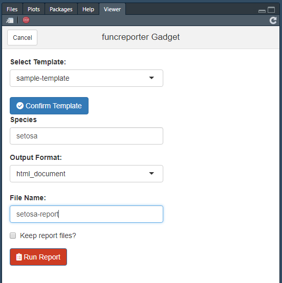

# funcreporter

<!-- badges: start -->


[](https://travis-ci.org/daranzolin/funcreporter)
<!-- badges: end -->

The goal of funcreporter is to interface with your parameterized Rmarkdown templates in a more intimate (and funky) fashion. Namely, via the `funcreporter()` function. This means loops and automation, coding instead of clicking.

## Installation

You can install the released version of funcreporter from GitHub with:

``` r
remotes::install_github("ir-sfsu/funcreporter")
```

## Setup

Inform `funcreporter` of your reporting package (this is the package that contains your Rmarkdown templates). Here we'll use the `funcreports` sample package:

``` r
remotes::install_github("daranzolin/funcreports")
library(funcreporter)
set_funcreporter_pkg("funcreports")
```

## Example

`funcreporter` is a wrapper around `rmarkdown::render` that locates package templates and renders output to your working directory.

``` r
funcreporter(
  template_name = "Sample Template", 
  output_file = "versicolor-report",
  params = list(species = "versicolor")
  )
```

## Multiple reports

Render more than one report:

``` r
species <- unique(iris$Species)
funcreporter(
  template_name = "Sample Template",
  output_file = paste0(species, "-report"),
  params = list(species = species, breaks = 15, plot_title = paste(species, "Distribution"))
)
```

Feel the power! Three reports for three species isn't much, but how about 50 reports for 50 clients? Get funky.

## The Gadget

Use `funcreporterGadget` for GUI reporting


