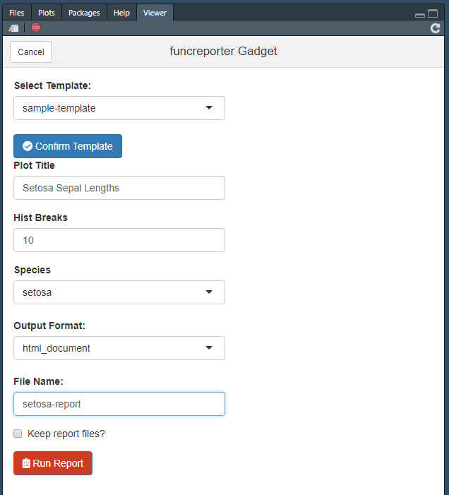

# funcreporter

<!-- badges: start -->


[](https://travis-ci.org/daranzolin/funcreporter)
<!-- badges: end -->

The goal of funcreporter is to interface with your parameterized Rmarkdown templates in a more intimiate (and funky) fashion. Namely, via the `funcreporter()` function. This means loops and automation, coding instead of clicking.

## Installation

You can install the released version of funcreporter from GitHub with:

``` r
remotes::install_github("daranzolin/funcreporter")
```

## Setup

Inform `funcreporter` of your reporting package (this is the package that contains your Rmarkdown templates):

``` r
library(funcreporter)
set_funcreporter_pkg("YOUR_PACKAGE_NAME")
```

## Example

`funcreporter` is a wrapper around `rmarkdown::render` that locates package templates and renders ouput to a specified location.

``` r
set_funcreporter_pkg("funcreporter")
funcreporter(
  template_name = "sample-template", 
  output_format = "html_document", 
  output_file = "versicolor-report.html",
  params = list(species = "versicolor")
  )
```

## Looping

Now for the real advantage and power behind functional reports: *loops.*

``` r
library(purrr)
iris_species <- unique(iris$Species)
out_files <- sprintf("%s-report.html", iris_species)
params <- map(iris_species, ~list(species = .x))
walk2(out_files, params, ~funcreporter("report", output_file = .x, params = .y))
```

Feel the power! Three reports for three species isn’t a lot, but how about 50 reports for 50 clients? Get funky.

## The Gadget

Use `funcreporterGadget` for GUI reporting


